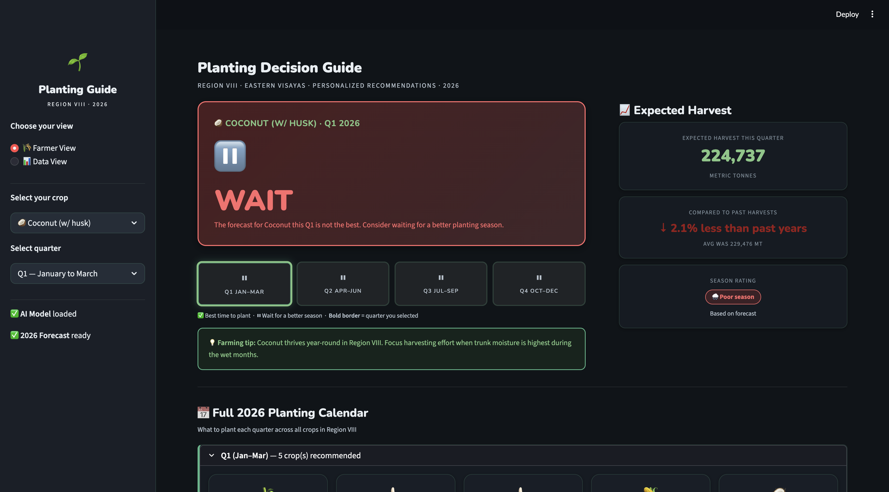
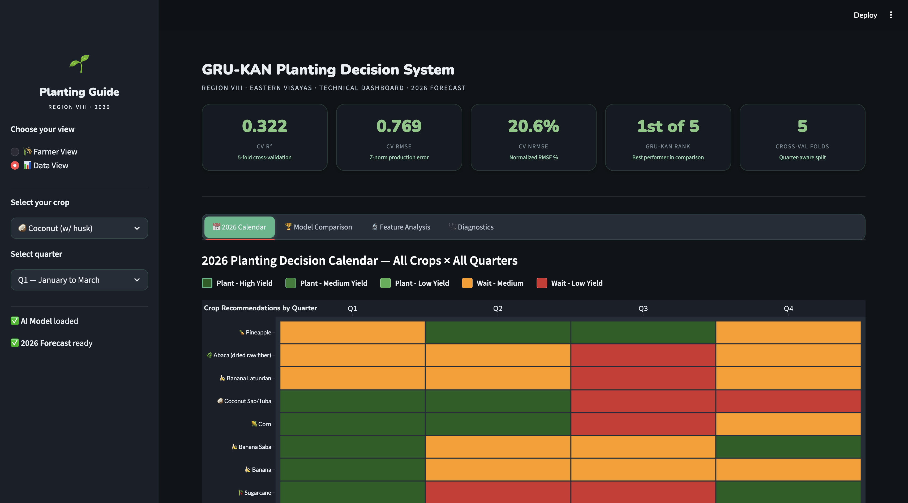

# 🌱 Eastern Visayas 2026 Planting Decision Guide

A Streamlit web application for optimizing planting decisions in Eastern Visayas (Region VIII), Philippines using a GRU-KAN hybrid deep learning model.

**Authors:** Kent Ryan D. Baluyot, Lorenzo Paul F. Lopez, Angelica Mae I. Moraca  
**Institution:** Mapúa University, School of Information Technology

---

## 📋 About

This thesis project addresses climate variability and agricultural uncertainty in Region VIII by building a data-driven decision support system. The application uses satellite data (Google Earth Engine), weather information (ERA5-Land), and vegetation indices (MODIS) combined with a GRU-KAN hybrid neural network to provide farmers with personalized planting recommendations for 10 major crops.

**Key Research:**
- Integrates geospatial-temporal data for crop yield prediction
- Compares GRU-KAN hybrid model against 4 baseline models
- Delivers 2026 quarterly planting calendar with confidence metrics

---

## 🎯 Features

### 🌾 Farmer View
Simple, actionable interface for farmers:
- **One-click decision:** PLANT or WAIT recommendations
- **Expected harvest:** Production forecasts in metric tonnes
- **Full 2026 calendar:** All crop-quarter recommendations



### 📊 Data View
Technical dashboard for data enthusiasts:
- **2026 Calendar Tab:** Interactive heatmap of all recommendations
- **Model Comparison Tab:** GRU-KAN vs SARIMAX, STARMA, ConvLSTM, Baseline GRU
- **Feature Analysis Tab:** Top 15 feature correlations with crop production
- **Diagnostics Tab:** Residual analysis, statistical tests, model performance



---

## 🚀 Quick Start

### Installation

```bash
cd EasternVisayasPlantingDecision
pip install -r requirements.txt
```

### Run the App

```bash
streamlit run app.py
```

---

## 📁 Project Structure

```
EasternVisayasPlantingDecision/
├── app.py                    # Main Streamlit app
├── style.css                 # Dark-mode styling
├── requirements.txt          # Dependencies
│
├── pkl/                      # Model artifacts
│   ├── grukan_final.pth     # Trained weights
│   ├── crop_scalers.pkl     # Feature normalization
│   ├── crop_thresholds.pkl  # Decision thresholds
│   └── config.pkl           # Configuration
│
├── datasets/                 # Data files
│   ├── planting_decision_calendar_2026.csv
│   ├── production_quarterly.csv
│   └── model_comparison.csv
│
└── notebook/
    └── thesis_final.ipynb   # Complete research notebook
```

---

## 🧠 Model: GRU-KAN Hybrid

- **Encoder:** 2-layer GRU (32 units) with temporal attention
- **Decoder:** KAN layers with RBF spline basis functions
- **Skip Connection:** Learnable residual bypass
- **Input:** 292 features × 4-quarter lookback
- **Output:** Normalized crop production prediction

**Performance (5-fold CV):**
- R² = 0.322
- RMSE = 0.769
- NRMSE = 20.6%
- **Ranked 1st of 5 models**

---

## 📊 Crops Covered

Coconut, Palay (Rice), Sugarcane, Banana, Banana Saba, Corn, Coconut Sap/Tuba, Banana Latundan, Abaca, Pineapple

---

## 📖 Usage

1. Select crop and quarter from sidebar
2. **Farmer View:** Get planting recommendation with forecast
3. **Data View:** Explore model performance and diagnostics

---

## 🔍 Data Sources

- **Climate:** ERA5-Land (ECMWF)
- **Vegetation:** MODIS (NASA)
- **Soil:** OpenLandMap
- **Production:** PSA (Philippine Statistics Authority)

All data accessed via **Google Earth Engine API**

---

## 📚 Research Thesis

Complete methodology, EDA, model training, and evaluation available in `notebook/thesis_final.ipynb`
